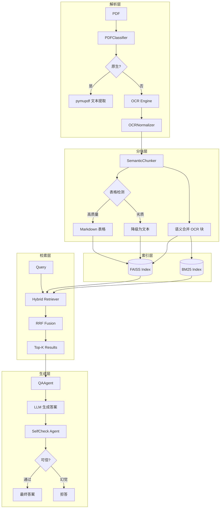

# JZ-RAG-Agent

企业级 Agent/RAG 文档问答系统。目标：可解释、可测试、可扩展、可治理幻觉、可适配扫描 PDF 的最小闭环系统。

> **核心定位**：面向扫描件 PDF 的智能文档问答 Agent。解决扫描件文字模糊、表格结构复杂、OCR 容易出错等工程难题。

---

## 1. 项目概述

**一句话介绍**：面向扫描件 PDF 的智能文档问答 Agent，融合 OCR、语义分块、混合检索、幻觉控制四大核心能力。

**核心能力**：
- **扫描件识别**：自动判断 PDF 类型（原生/扫描件），选择最优解析策略
- **OCR 解析**：支持 rapidocr + paddleocr 双引擎，自动纠正 l/1、O/0 混淆
- **表格处理**：表格质量评分 + 降级策略，避免空洞 Markdown 生成
- **混合检索**：BM25（精确）+ Dense（语义）+ RRF 融合，兼顾关键词与语义
- **幻觉控制**：Score 阈值拒答 + SelfCheck Agent 自检答案可信度

---

## 2. 系统架构

### 2.1 核心流程



### 2.2 目录结构

```
jz-rag-agent/
├── app/
│   ├── agents/           # Agent 模块
│   │   ├── qa_agent.py         # 问答 Agent（检索+生成+决策）
│   │   └── self_check_agent.py  # 幻觉自检 Agent
│   ├── chunkers/         # 分块策略模块
│   │   └── semantic_chunker.py   # 语义分块（表格评分+降级）
│   ├── core/
│   │   └── config_loader.py     # YAML+Env 配置加载
│   ├── parsers/         # PDF 解析模块
│   │   ├── pdf_classifier.py    # 扫描件/原生 PDF 分类
│   │   ├── pdf_parser.py       # 统一解析入口
│   │   ├── ocr_parser.py       # OCR 引擎封装
│   │   └── table_extractor.py   # 表格提取
│   ├── prompts/         # 提示词模板
│   │   └── qa_prompt.py        # QA/SelfCheck/路由提示词
│   ├── retrievers/     # 检索模块
│   │   ├── vector_store.py      # FAISS 向量存储
│   │   └── hybrid_retriever.py   # BM25+Dense+RRF 混合检索
│   ├── schemas/        # 数据模型
│   │   └── common.py           # DocumentChunk 定义
│   └── services/       # 基础服务
│       ├── embedding_service.py   # HuggingFace Embedding
│       └── llm_service.py       # OpenAI 兼容 LLM 调用
├── configs/
│   └── config.yaml            # 路径/模型配置
├── data/
│   ├── raw/                   # 原始 PDF
│   ├── parsed/                # 解析缓存
│   ├── chunks/                # BM25 索引
│   └── vector_store/          # FAISS 索引
├── scripts/
│   ├── test_parsers.py         # 解析器测试脚本
│   └── evaluate.py             # 评估脚本
├── tests/
│   └── test_chunker.py         # 分块器单元测试
├── main.py                    # CLI 主入口
└── pyproject.toml
```

### 2.3 核心模块说明

| 模块 | 文件 | 职责 |
|------|------|------|
| **PDFClassifier** | `app/parsers/pdf_classifier.py` | 判断扫描件/原生 PDF |
| **OCRParser** | `app/parsers/ocr_parser.py` | OCR 双引擎封装 + Normalizer |
| **SemanticChunker** | `app/chunkers/semantic_chunker.py` | 语义合并 + 表格质量评分/降级 |
| **HybridRetriever** | `app/retrievers/hybrid_retriever.py` | BM25+Dense+RRF |
| **QAAgent** | `app/agents/qa_agent.py` | 问答流水线编排 |
| **SelfCheckAgent** | `app/agents/self_check_agent.py` | 幻觉检测 |

---

## 3. 快速开始

### 3.1 环境要求

- Python 3.10+（推荐 3.11）
- uv 包管理器
- 4GB+ 内存（Embedding 模型加载）

### 3.2 安装步骤

```bash
# 1. 创建虚拟环境
uv venv

# 2. 激活虚拟环境
# Windows:
.venv\Scripts\activate
# Linux/Mac:
source .venv/bin/activate

# 3. 安装依赖
uv pip install -e .
```

### 3.3 配置说明

```bash
# 复制环境变量模板
cp .env.example .env

# 编辑 .env，填入以下配置：
```

**.env 配置项**：

```bash
# LLM 配置（MiniMax 示例）
MINIMAX_API_KEY=your_api_key_here
MINIMAX_BASE_URL=https://api.minimax.chat/v1
MINIMAX_MODEL_NAME=MiniMax-M2.7

```

### 3.4 运行命令

```bash
# 构建索引（首次运行或 PDF 更新后）
uv run python main.py --build-index

# 执行问答
uv run python main.py --query "键的技术条件包含哪些内容？"

# 指定返回结果数量
uv run python main.py --query "平键的键宽是多少" --top-k 3
```

---

## 4. 核心设计

### 4.1 扫描件 PDF 识别与 OCR

#### 判断逻辑

```python
# PDFClassifier 核心逻辑
text_pages = sum(1 for page in doc if len(page.get_text()) > 50)
text_ratio = text_pages / total_pages
is_scanned = text_ratio < 0.1  # 文本比例 < 10% 判定为扫描件
```

#### OCRNormalizer 规则

| 场景 | 示例 | 纠正规则 |
|------|------|---------|
| l 在两个数字之间 | `12l3` → `1213` | `(?<=\d)l(?=\d)` |
| O 在两个数字之间 | `12O3` → `1203` | `(?<=\d)O(?=\d)` |
| 多余空格合并 | `键  宽` → `键 宽` | `[ \t]{2,}` → ` ` |
| 行首行尾空格 | `  内容  ` → `内容` | `^[ \t]+\|[ \t]+$` |

> **设计原则**：仅在数字上下文中纠正，避免破坏正常文本（如 `label` 不应被纠正）。

### 4.2 分块策略（重点）

#### 语义合并：基于坐标聚类

```python
# merge_ocr_blocks 核心逻辑
1. 按 Y 坐标排序（行顺序）
2. Y 差值 < avg_line_height * 0.5 视为同一行
3. 同行块按 X 排序并合并
4. 行间距 < avg_line_height * 1.5 视为同一段落
```

**效果**：将散乱的 OCR 文本块（如 "3.1"、"键的硬度应不低于 590MPa"）合并为完整段落。

#### 表格处理：质量评分 + 降级

```python
# SemanticChunker 表格评分逻辑
1. 计算列数（通过 Markdown 分隔线 | 的数量）
2. 计算每列平均单元格数
3. 计算有效单元格比例

# 降级决策树
is_sparse = valid_cell_ratio < 0.5        # >50% 单元格为空
is_too_wide = col_count > 10             # 列数 > 10
is_sparse_cols = avg_cells_per_col < 2.5   # 每列 < 2.5 个单元格

if is_sparse or is_narrow_table:
    # 降级为普通文本块
    content = "\n".join(cell_texts)
elif is_too_wide or is_sparse_cols:
    # 保留文本形式（不生成 Markdown）
    content = " ".join(cell_texts)
else:
    # 保留 Markdown 表格
    content = markdown_table
```

#### 设计取舍：为什么选择"表格降级为文本"？

```
问题：OCR 表格识别容易产生空洞的 Markdown，如：
| | | | | | | | | | J18 | | | | | |
|---|---|---|---|---|---|---|---|---|---|
| | | | | | | | | | | | | | | | | |

分析：
1. 扫描件 PDF 的表格线模糊，OCR 难以准确定位单元格边界
2. 多列表格（>10列）在技术文档中常见，但 Markdown 表格列对齐困难
3. LLM 对纯文本的理解能力强于解析混乱的 Markdown

决策：
- 劣质表格 → 降级为文本，用换行分隔内容
- 降级后的文本对 LLM 更友好，能准确提取"键宽b=6"等信息
- 避免出现"幻觉答案"因表格结构错误而误导 LLM
```

### 4.3 混合检索

#### 为什么 OCR 场景必须用混合检索？

| 检索方式 | 优势 | 劣势 | OCR 场景适配 |
|---------|------|------|-------------|
| **BM25** | 关键词精确匹配 | 无法处理语义 | ✅ 保留（如"键宽"必须精确匹配） |
| **Dense** | 语义理解 | 对 OCR 错误敏感 | ⚠️ 需要清洗后的文本 |
| **RRF Fusion** | 综合两者优势 | 参数调优复杂 | ✅ 使用 RRF_K=60 |

#### RRF 算法

```python
# RRF (Reciprocal Rank Fusion)
RRF_K = 60
final_score = weight_v / (RRF_K + rank_v) + weight_bm25 / (RRF_K + rank_bm25)

# 当前权重配置
vector_weight = 0.7   # Dense 检索
bm25_weight = 0.3     # 关键词检索
```

### 4.4 幻觉控制（重点）

#### 拒答机制

```python
# QAAgent.answer() 中的判空逻辑
if not retrieval_results:
    return reject("未找到相关文档")

top_score = retrieval_results[0].get("score", 0)
if top_score < score_threshold:  # 0.0001
    return reject(f"检索分数过低 ({top_score:.4f})")
```

#### SelfCheck Agent

```python
# SelfCheck 流程
1. 拼接 Prompt：参考资料 + 答案
2. 调用 LLM 判断：grounded / hallucination / uncertain
3. 解析 JSON 返回：{is_grounded, confidence, reasoning}

# 决策逻辑
if self_check["is_grounded"]:
    return answer  # 直接返回
elif confidence >= 0.7:
    return reject("答案存在幻觉风险，已拒绝")
else:
    return answer + "[警告：部分内容未确认]"  # 带警告返回
```

#### SelfCheck Prompt

```
你是一个答案质量评估助手。请评估以下答案是否由参考资料支撑。

要求：
1. 如果答案中的信息在参考资料中可以找到，标记 is_grounded 为 true
2. 如果答案中的信息在参考资料中找不到或与资料矛盾，标记 is_grounded 为 false
3. reasoning 字段简要说明判断理由

请以 JSON 格式输出：
{"is_grounded": true/false, "confidence": 0.0-1.0, "reasoning": "判断理由"}
```

---

## 5. 测试与评估

### 5.1 测试用例设计（5 类问题）

根据 CLAUDE.md 预设，测试集应包含：

| 类型 | 示例问题 | 验证目标 |
|------|---------|---------|
| **正文查询** | "键的技术条件包含哪些内容？" | 正文解析完整性 |
| **表格查询** | "平键的键宽是多少？" | 表格内容提取 |
| **无答案问题** | "汽车维修流程是什么？" | 拒答机制有效 |
| **OCR 容错** | "键的技术条件包含哪些内溶？" | 模糊匹配能力 |
| **模糊问题** | "包装要求" | 语义理解能力 |

### 5.2 评估脚本

```bash
# 运行评估
uv run python scripts/evaluate.py

# 强制重建索引后评估
uv run python scripts/evaluate.py --force-reparse
```

**输出格式**（Markdown 报告）：

```markdown
| 问题 | 答案 | 来源页码 | 是否拒答 | 耗时 |
|------|------|---------|---------|------|
| 键的技术条件包含哪些内容？ | 技术条件包括... | Page 3 | 否 | 1.2s |
```

### 5.3 单元测试

```bash
# 运行分块器单元测试
uv run python tests/test_chunker.py

# 运行解析器集成测试
uv run python scripts/test_parsers.py --force-reparse
```

---

## 6. 已知局限与改进方向

### 6.1 已知局限

| 问题 | 原因 | 影响 |
|------|------|------|
| **多列表格列对应丢失** | OCR 坐标聚类无法完美对齐所有列 | "键宽" 等信息能提取，但行列对应关系可能错位 |
| **表格降级策略保守** | 当前阈值为 10 列，可能漏掉部分有效表格 | 技术文档中超过 10 列的表格会被降级 |
| **OCRNormalizer 仅处理 l/1、O/0** | 其他 OCR 错误（如相近字符混淆）未处理 | 部分特殊符号可能识别错误 |

### 6.2 改进方向

| 方向 | 方案 | 优先级 |
|------|------|---------|
| **专用表格模型** | 使用 PaddleOCR PP-Structure 或 TableMaster | 高 |
| **人工校验流程** | 对降级表格进行二次确认 | 中 |
| **自适应阈值** | 根据文档类型动态调整表格降级阈值 | 低 |
| **支持更多 OCR 错误** | 扩展 OCRNormalizer 规则 | 中 |

---

## 7. 方案迁移性

### 7.1 金融场景

**场景**：合同条款检索、风险点识别

**适配要点**：
- 更换为金融 PDF（合同、报表）
- 调整表格降级阈值（金融表格通常 6-8 列）
- 使用金融领域Embedding模型（如 `text2vec-base-chinese`）

**关键配置**：
```yaml
# configs/config.yaml
chunking:
  table_width_threshold: 8  # 金融表格列数较少
  sparse_cell_ratio: 0.4     # 更严格的表格质量要求
```

### 7.2 合规场景

**场景**：法规问答、条款溯源

**适配要点**：
- 合规文档通常原生 PDF 为主，可降低 OCR 权重
- 增加引用溯源功能（SelfCheck 强化）
- 章节标题识别（`_detect_section` 扩展）

### 7.3 多语言

**适配要点**：
- 更换 OCR 引擎：`paddleocr` 支持多语言（需指定 `lang` 参数）
- 更换 Embedding 模型：使用多语言模型（如 `paraphrase-multilingual-mpnet-base-v2`）
- LLM 支持多语言对话

```python
# 多语言 OCR 配置
OCRParser(use_rapidocr=True)  # rapidocr 支持多语言
# 或
PaddleOCR(lang="en", use_angle_cls=True)
```

---

## 8. AI 辅助开发说明

### 8.1 使用 Claude Code 生成代码框架

本项目使用 Claude Code 辅助开发，遵循以下流程：

```
1. 提出需求 → Claude Code 生成代码框架
2. 人工校验 → 检查架构合理性、异常处理、幻觉风险
3. 本地测试 → scripts/test_parsers.py 验证解析效果
4. 迭代优化 → 根据测试结果调整参数（如表格降级阈值）
```

### 8.2 人工校验要点

| 模块 | 校验重点 |
|------|---------|
| **OCRNormalizer** | 正则是否过于激进？`l/1` 纠正是否破坏正常单词？ |
| **SemanticChunker** | 表格降级阈值是否合适？降级文本是否可读？ |
| **HybridRetriever** | RRF 权重是否合理？Dense/BM25 比例是否需要调整？ |
| **SelfCheckAgent** | JSON 解析是否健壮？拒答逻辑是否过于保守？ |

### 8.3 修正案例：表格降级策略的迭代

**第一版**：所有 OCR 检测到的表格都转为 Markdown
- 问题：封面、页眉被误判为表格，生成大量 `| | |` 空单元格

**第二版**：简单过滤，非空比例 < 30% 降级
- 问题：多列表格（如 30 列质检表）仍然生成空洞 Markdown

**第三版**（当前）：多维度评分 + 降级策略
```
if is_sparse or is_narrow_table:
    → 降级为换行分隔的文本
elif is_too_wide or is_sparse_cols:
    → 降级为空格分隔的文本
else:
    → 保留 Markdown
```
- 效果：25 个 chunks，0 个空洞表格，所有表格内容可读

---

## 9. 完成情况

### 已完成 ✅

| 模块 | 状态 | 说明 |
|------|------|------|
| 扫描件识别 | ✅ | PDFClassifier 判断 PDF 类型 |
| OCR 解析 | ✅ | rapidocr/paddleocr 双引擎 |
| OCR 规范化 | ✅ | l/1、O/0、空格修复 |
| 语义分块 | ✅ | 坐标聚类 + 段落合并 |
| 表格处理 | ✅ | 质量评分 + 降级策略 |
| 混合检索 | ✅ | BM25 + Dense + RRF |
| 问答生成 | ✅ | QAAgent 流水线 |
| 幻觉自检 | ✅ | SelfCheckAgent |
| 缓存机制 | ✅ | JSON 缓存 + 版本控制 |
| CLI 界面 | ✅ | main.py --build-index / --query |

### 已知问题 ⚠️

| 问题 | 影响 |
|------|------|
| 多列表格列对应可能丢失 | 提取"键宽=6" 准确，行列对应可能错位 |
| 表格降级阈值固定 | 某些特殊表格可能被错误降级 |

### 未完成 ❌

| 功能 | 优先级 |
|------|--------|
| 前端界面 | 低（CLI 优先） |
| FastAPI 服务 | 中（已完成基础结构） |
| 多文档联合问答 | 低 |
| 评估脚本完善 | 中 |

---

## 附录：关键配置参考

### pyproject.toml 依赖版本

```toml
# OCR 相关（避免 onnxruntime 与 Python 3.10 冲突）
onnxruntime = ">=1.15.0,<1.18.0"

# 向量存储
faiss-cpu = ">=1.8.0"

# Embedding
sentence-transformers = ">=2.5.0"
bge-m3 = "BAAI/bge-m3"
```

### main.py CLI 选项

```bash
# 构建索引
--build-index              # 构建向量 + BM25 索引
--force-reparse           # 强制重新解析 PDF（忽略缓存）

# 问答查询
--query "问题"            # 执行问答
--top-k 5                 # 返回 Top-K 结果（默认 5）
```
